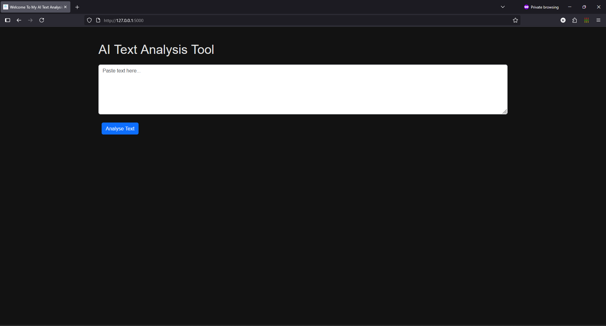
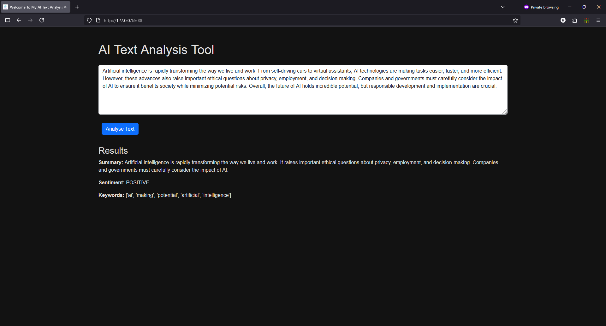

AI Text Analysis Web App

A simple Flask-based web application that uses Hugging Face Transformers to perform:

Text Summarisation

Sentiment Analysis

Keyword Extraction

This project demonstrates how AI models can be integrated into real-world applications ideal for learning and for showcasing practical AI skills.

==============================================================================================

🚀 Features

Paste text into a web form and instantly:

Get a summary (powered by BART model).

Detect sentiment (positive/negative/neutral).

Extract keywords (basic NLP + frequency analysis).

Clean, responsive Bootstrap UI.

Runs locally for free using Hugging Face pre-trained models.

==============================================================================================

🧩 Tech Stack

Backend: Python, Flask

AI Models: Hugging Face Transformers (facebook/bart-large-cnn, distilbert-base-uncased-finetuned-sst-2-english)

NLP Tools: NLTK (stopwords, tokenisation)

Frontend: HTML, CSS, Bootstrap

==============================================================================================

📂 Project Structure

AI-Text-Analysis-App/
│
├── app.py                    # Flask backend
├── venv/                     # Python virtual environment
├── templates/
│   └── index.html            # Frontend (HTML + Bootstrap, Dark Mode)
├── static/
│   ├── css/
│   │   └── style.css         # Custom CSS (dark mode, styling)
│   └── images/
│       └── favicon.ico       # Favicon icon
├── requirements.txt          # Python dependencies
└── README.md                 # Project documentation

==============================================================================================

🎨 Dark Mode & Favicon

Dark mode is enabled by default via static/css/style.css.

Favicon is located in static/images/favicon.ico and linked in templates/index.html.

==============================================================================================

🔓 Installation & Setup

Step 1: Clone the repo

git clone https://github.com/your-username/AI-Text-Analysis-App.git
cd AI-Text-Analysis-App

Step 2: Create the Virtual Enviroment

python -m venv venv
source venv/bin/activate   # Mac/Linux
venv\Scripts\activate      # Windows

Step 3: Install the Dependencies

pip install -r requirements.txt

Step 4: Run the App

python app.py

Step 5: Open your browser of choice and open:

http://127.0.0.1:5000

==============================================================================================

‼️Requirements

Your requirements.txt file should include:

flask
transformers
torch
nltk

==============================================================================================

💭 Example Usage

Input Text:

Artificial intelligence (AI) is rapidly transforming industries worldwide. 
Companies are using AI to automate processes, enhance decision-making, and 
deliver personalised experiences to customers.

Output:

Summary: AI is transforming industries by automating processes, improving decision-making, and personalising customer experiences.

Sentiment: Positive

Keywords: ['ai', 'transforming', 'industries', 'automating', 'processes']

==============================================================================================
📸 Screenshots

Homepage of the app:  

Analysis result example:  

==============================================================================================

💡 What I Learned

- How to integrate Hugging Face Transformer models with Flask.

- Handling user input securely and efficiently for NLP tasks.

- Building a clean, responsive frontend using Bootstrap.

- End-to-end project development using MVC architecture and Agile practices.

==============================================================================================

🔜 Future Improvements

Add a word cloud visualisation for extracted keywords.

Support multiple summarisation models (BART, T5, Pegasus).

Deploy to Heroku / AWS for live demo.

==============================================================================================

🧙🏽‍♂️ Author

Hudayfa Omar

💼 [LinkedIn](https://www.linkedin.com/in/hudayfa-omar-509623298/)

💻 [GitHub](https://github.com/HudayfaOmar23)
